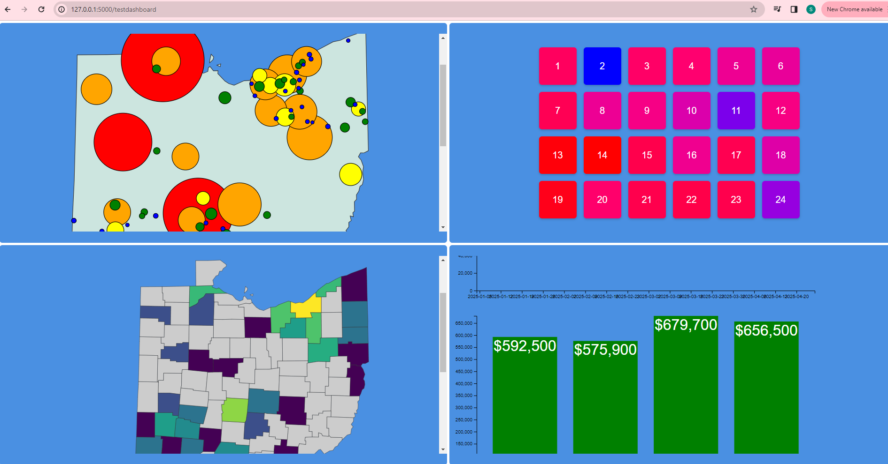
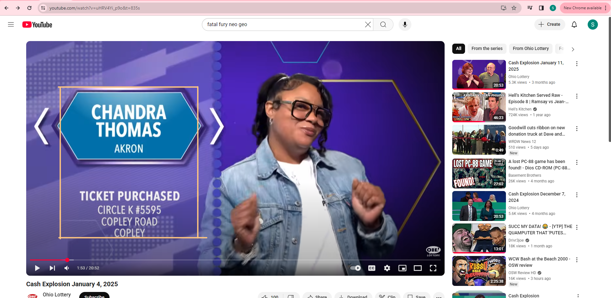

# Cash Explosion Data Center

## Overview

The goal is the gather data from the Cash Explosion Game Show and visualize them using a data.

## The Beginning

Cash Explosion is an Ohio Lottery Game show where players from all across Ohio and sometimes beyond compete to win as much money as possible.  Here is a sample episode from this year:

[Cash Explosion January 4, 2025](https://www.youtube.com/watch?v=uHRV4Yi_p9o)

The game starts with eight players.  One by one, each player takes it in turn to pick three numbers from 1-24.  When everyone takes their turn, the top two players will have their winnings doubled and will move immedialtey to the championship game aka Cash Challenge.  However, the night is not over for the remaining six, because they will all compete in the Second Chance round where each of the remaing contestants will pick a letter in "SECOND CHANCE".  Each of those letters has a number from 1-12.  The player that picks the highest number will receive an additional $5,000 and competes in the Cash Challenge.

In the Cash Challlenge Round, All four contestanets have their names on a board numbered 1-12, three times.  The first player to have his or her name discovered three times will be the champion and will return next week to compete for more money.  

## Project Motivation

The reason why I did this project is because I like data and game shows.  Every Saturday Night, living in Ohio, I watch Cash Explosion and get very excited when people win a lot of money.  I have done a project similar to this in 2019.  It was hosted on Heroku at the time and I was able to track the data by Ohio counties.  However, I wanted to expand on what was possible for 2025.  I rekindled my love for data and wanted to see the data in many different ways.  

## Project Description

Now that you understand my motivation and how the game is played.  The project is divided in two parts:

- Data Entry
    - HTML Forms (Front End)
    - OCR Tesseract (Python)
    - Validation
- Data Visualization
    - D3

## Workflow
1. Start at splash.html to enter in the date the show aired
    - Date must be entered and then press the START button
        - Once the date is validated and entered, there will be two localStorage variables (player# and date).
    - however, the user can go to the dashboard instead.
2. Clicking on the Dashboard button goes to the dashboard screen.

    - There are 4 panels
    - Panels can be expanded by clicking on the lower part of each panel.  When the cursor turns into a pointer, you can expand the panel
    - Once the panel is expanded, you can then collapse it by clicking on the X at the upper right hand corner.
        1. Winnings by ticket purchased city
            - There are two views that you can choose
                1. Total amount won in cities that tickets are purchased
                    - Think colors of the rainbow from largest amount to smallest amount
                    - Red -> Orange -> Yellow -> Green -> Blue
                    - You can click on a circle to display the tooltip of the infomation.
                2. Average winnings by city based on number of contestants.
        2. Numbers Selected in gameplay
            - There are three views that you can choose
            - Colors below go from highest to lowest value
            - Red -> Pink -> Purple -> Blue
            1. Average Base Score based on numbers
                -   Score range from $2300 to $3000
            2. The frequency of numbers selected
                - Numbers 1 and 20 were selected 10 tiimes sofar.
                - Number 9 was selected 27 times
            3. The number of times a special event is chosen for that number
                - Number 20 has 0 special events
                - Number 8 has 6 special events
                - *It is possible to have another view as a bar graph
        3. Winnings by the County
            - There are 4 total views
                1. Number of tickets purchased by county
                2. Game Total Winnings by county
                    - Purple is counties that have an average game total more than $10,000
                    - Yellow is counties that have an average game total less than $10,000
        4. Winnings by week and month
            - There are two graphs
            - The first tracks the wekly winnings for thatt episode
            - The second graph is winnings for the month.
3. When you enter a date at the beginning of the screen
    - filename: index.html
    - There are 4 sections for gathering the data to put in the database
        1. Player Info
            - The inputs you will need are name, city, ticket purchased store, name of the road, and the city where it was purchased.
            - Verification is if the input boxes are not empty.
            -  There are two buttons, one to confirm your inputs and disable them once confirmed.
            - The other button is the Get Name the information by taking a snapshot of the area shown below
            
            - The file is extractorimagetextcopy.py.  It goes through a Flask app and it will attempt to get and fill out the information of what was on screen at the time.
            - You will have to edit out some of the garbage that it snaps.  
            - You must import PIL, pytesseract, and pyautogui to use the Get Name button.
        2. Nummbers
            - Putting three numbers in from 1-24.  There is validation for HTML5 and JavaScript.
        3. Score / Bonus
            - Each turn cooresponds to the order they picked the number.
            - For each number, you can choose if a special square was revealed and the dollar amount from the dropdown
            - Special Squares
                - 2x (Doubles the amount)
                - 3x (Triples the amount)
                - Bonus (from $10000 to $50000)
                - Ticket Jackpot
                - Extra Play (Player gets to pick another number)
        4. Verification
            - Has the Player name, city, the amount they won
            - The amount they won should confirm what the hosts and gameplay say
            - Hit the Verify button to refresh for the next player.
            - localStorage variable player# keeps a running count of the player number.  If player# reaches 9, we will proceed to the next screen, the endgame
4. Endgame.html (Where all 8 players have played their game)
- Players game totals are ordered from most to least.  The top two players will have their totals doubled and will proceed to the cash challenge
- The after double section is revealed with the top two scorers.